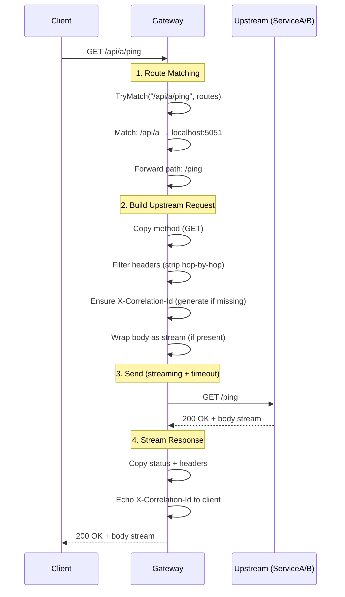
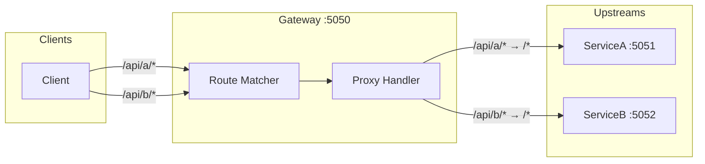

# Mini API Gateway

A learning-focused API gateway for understanding routing, concurrency, and systems concepts.

## Request Flow



## Architecture



## Key Concepts

### Hop-by-Hop Headers
Headers that describe the connection between two adjacent nodes, not the end-to-end request:
- `Connection`, `Keep-Alive` — connection settings for this hop only
- `Host` — must be set to upstream's host
- `Transfer-Encoding` — gateway may re-chunk

### Streaming vs Buffering
```
Buffering:  Client ──[100MB]──► Gateway ──[100MB in RAM]──► Upstream
Streaming:  Client ──[chunk]──► Gateway ──[chunk]──► Upstream (repeat)
```
We use `HttpCompletionOption.ResponseHeadersRead` + `StreamContent` to stream both directions.

### Cancellation Propagation
`ctx.RequestAborted` fires when:
- Client disconnects
- Request times out
- Server shuts down

Passed to `SendAsync` and `CopyToAsync` to stop wasted work.

### Correlation IDs
The gateway ensures every request has an `X-Correlation-Id`:
- If client provides one, we propagate it upstream.
- Otherwise the gateway generates one.
- The gateway echoes it back in the response header so you can grep logs across services.

### Timeouts (per route)
Each route has its own timeout budget. On timeout, the gateway returns `504 Gateway Timeout` and cancels the upstream request.

## Setup

```bash
# Copy env template and adjust if needed
cp .env.example .env
```

The `.env` file configures upstream URLs and per-route timeouts:
```
UPSTREAM_SERVICE_A=http://localhost:5051
UPSTREAM_SERVICE_B=http://localhost:5052
TIMEOUT_API_A_MS=1500
TIMEOUT_API_B_MS=1500
```

## Running

```bash
# Terminal 1: Gateway (reads .env automatically)
dotnet run --project src/Gateway

# Terminal 2: ServiceA  
dotnet run --project src/ServiceA

# Terminal 3: ServiceB
dotnet run --project src/ServiceB
```

## Testing

```bash
# Through gateway → ServiceA
curl http://localhost:5050/api/a/ping
curl http://localhost:5050/api/a/slow?ms=1000
curl http://localhost:5050/api/a/fail?rate=0.5

# Through gateway → ServiceB
curl http://localhost:5050/api/b/ping
```

## Milestones

- [x] **M0**: Skeleton & dev loop
- [x] **M1**: Reverse proxy routing
- [x] **M2**: Correlation IDs & logging
- [x] **M3**: Timeouts & cancellation
- [ ] **M4**: Authentication
- [ ] **M5**: Rate limiting (429)
- [ ] **M6**: Concurrency bulkhead (429)
- [ ] **M7**: Retries (safe methods only)
- [ ] **M8**: Circuit breaker
- [ ] **M9**: Observability
- [ ] **M10**: Load testing & analysis
