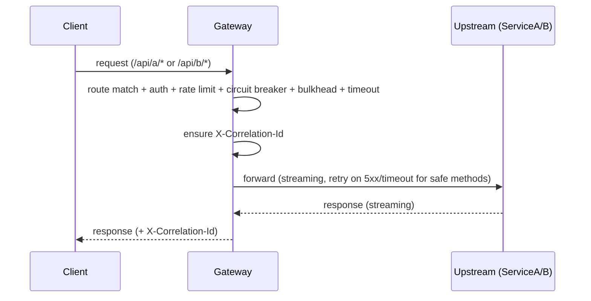
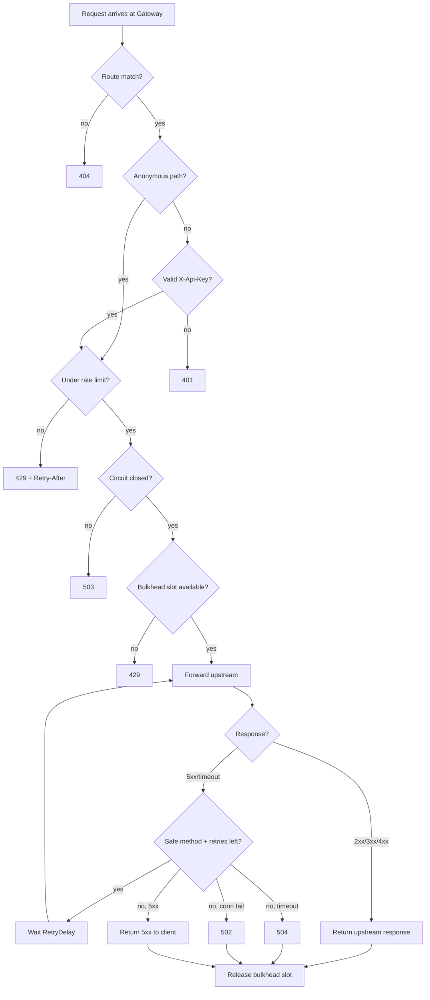
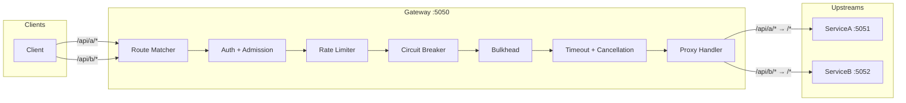

# Mini API Gateway

A learning-focused API gateway for understanding routing, concurrency, and systems concepts.

## Request Flow



### Decision flow (auth + rate limit + bulkhead + retry + timeout)



### Response codes (gateway)

| Status | Meaning |
|---|---|
| 401 | Missing/invalid `X-Api-Key` (non-anonymous route) |
| 404 | No matching route prefix |
| 429 | Rate limit exceeded (per-client, includes `Retry-After`) or bulkhead full (global) |
| 502 | Upstream connection failed (after all retries exhausted) |
| 503 | Circuit breaker open — upstream is down, not even attempting |
| 504 | Upstream exceeded per-route timeout budget (after all retries exhausted) |

## Architecture



## Key Concepts

### Hop-by-Hop Headers
Headers that describe the connection between two adjacent nodes, not the end-to-end request:
- `Connection`, `Keep-Alive` — connection settings for this hop only
- `Host` — must be set to upstream's host
- `Transfer-Encoding` — gateway may re-chunk

### Streaming vs Buffering
```
Buffering:  Client ──[100MB]──► Gateway ──[100MB in RAM]──► Upstream
Streaming:  Client ──[chunk]──► Gateway ──[chunk]──► Upstream (repeat)
```
We use `HttpCompletionOption.ResponseHeadersRead` + `StreamContent` to stream both directions.

### Cancellation Propagation
`ctx.RequestAborted` fires when:
- Client disconnects
- Request times out
- Server shuts down

Passed to `SendAsync` and `CopyToAsync` to stop wasted work.

### Correlation IDs
The gateway ensures every request has an `X-Correlation-Id`:
- If client provides one, we propagate it upstream.
- Otherwise the gateway generates one.
- The gateway echoes it back in the response header so you can grep logs across services.

### Timeouts (per route)
Each route has its own timeout budget. On timeout, the gateway returns `504 Gateway Timeout` and cancels the upstream request.

### Authentication (API key)
The gateway enforces a simple API key at the edge:
- **Header**: `X-Api-Key: <value>`
- **Config**: set `API_KEY` in `.env`
- **Anonymous allowlist**: per-route `AllowAnonymousPrefixes` (e.g. `["/health"]`)
- **Important**: the gateway should **not forward** `X-Api-Key` to upstreams (avoid credential leakage via upstream logs/bugs).

### Rate Limiting (per route, per client)
Fixed-window counter using `ConcurrentDictionary` + `Interlocked.Increment`:
- **Key**: `{routePrefix}:{clientId}` — authenticated clients keyed by API key, anonymous by IP
- **Config**: `RequestsPerWindow` and `Window` per route (via `.env`)
- **Response**: `429 Too Many Requests` with `Retry-After` header (seconds until window resets)
- **Trade-off**: fixed-window is approximate under concurrency (off by a few requests at window boundaries) — acceptable for a gateway protecting upstreams from overload.

### Concurrency Bulkhead (per route, global)
Limits in-flight requests to each upstream using a semaphore per route:
- **Semaphore**: a lock that allows N holders instead of 1. Acquire decrements, release increments.
- **Config**: `MaxConcurrentRequests` per route (via `.env`)
- **Response**: `429 Too Many Requests` (no `Retry-After` — retry immediately, a slot may free up)
- **Why both?** Rate limiting (M5) ensures fairness — one client can't hog capacity. Bulkhead (M6) ensures safety — the upstream won't be overwhelmed regardless of how many clients are sending requests.

### Design Decision: Fail Fast vs Queue

When the bulkhead is full, we return 429 immediately instead of queuing the request. Why?

**Problems with queuing inside the gateway:**
- **Memory pile-up**: each queued request holds an HttpContext, connection, buffers. 1000 waiting requests = 1000 contexts in RAM.
- **Client timeout mismatch**: client gives up after 10s, but the queue holds the request for 30s. The slot finally frees, we forward upstream, send response — but the client hung up 20s ago. Wasted work.
- **Hidden backpressure**: 429 tells clients "slow down." A queue hides the problem — clients think everything is fine, keep sending, queue grows unbounded.
- **Cascading failure**: upstream slow → slots don't free → queue grows → memory exhausted → gateway crashes.

**Production architecture for high load:**
1. **Gateway fails fast** — instant 429, don't hold connections
2. **Client retries with exponential backoff** — client waits 100ms, 200ms, 400ms between retries. The *client* queues, server stays stateless
3. **Load balancer distributes** — if Gateway 1 is full, route to Gateway 2
4. **Autoscaling reacts** — 429 rate spikes → spin up more instances
5. **Async for slow work** — return `202 Accepted` + job ID, process via message queue, client polls for result

**The principle**: synchronous HTTP should be fast or fail. If it can't be fast, make it async. Queuing inside a synchronous gateway gives you the worst of both — you hold resources *and* make clients wait.

### Circuit Breaker (per route)
Tracks consecutive upstream failures per route using a state machine:
- **Closed**: healthy — requests flow through, failures are counted
- **Open**: upstream is broken — reject all requests immediately with 503, don't waste resources trying. Failures counted against a configurable threshold (e.g., 5 consecutive failures trips the circuit).
- **Half-Open**: cooldown expired — allow exactly one test request through. If it succeeds, close the circuit (upstream recovered). If it fails, reopen and restart the cooldown.
- **Config**: `CircuitBreakerThreshold` (failures to trip) and `CircuitBreakerCooldown` (how long to wait before testing) per route.
- **Why it matters**: retries handle transient failures (one bad request). The circuit breaker handles sustained failures (upstream is down). Without it, retries just amplify the problem — 1000 clients each retrying 3x = 3000 requests hitting a service that's already struggling to recover.

### Observability
A `/gateway/status` endpoint exposes the internal state of the gateway in real time:
- **Uptime**: how long the gateway has been running
- **Per-route metrics**: total requests, total errors, average latency
- **Circuit breaker state**: Closed, Open, or HalfOpen per route
- **Bulkhead availability**: how many concurrent slots are free vs max per route
- **No auth required**: the status endpoint is registered before the catch-all route so it bypasses the proxy pipeline entirely
- **Thread safety**: request/error counters use `Interlocked.Increment`, latency uses a lock for running average — same patterns as the rate limiter

### Retries (safe methods only)
Automatic retry for transient upstream failures:
- **Safe methods only**: GET, HEAD, OPTIONS are idempotent — retrying them is safe. POST/PUT/DELETE might cause duplicate side effects (e.g., charging a payment twice).
- **Retry conditions**: 5xx responses, timeouts, connection failures. Never retry 4xx — that's a client error, retrying won't help.
- **Config**: `MaxRetries` (number of additional attempts) and `RetryDelay` (base delay) per route.
- **Exponential backoff**: delay doubles each attempt (100ms → 200ms → 400ms). Gives the upstream more time to recover.
- **Jitter**: adds 0-50% random delay to prevent thundering herd — when a service recovers, 1000 clients shouldn't all retry at exactly the same moment.
- **Fresh timeout per attempt**: each retry gets its own timeout budget, so earlier attempts don't eat into later ones.
- **Must recreate request**: `HttpRequestMessage` can only be sent once, so we rebuild it each attempt.

## Setup

```bash
# Copy env template and adjust if needed
cp .env.example .env
```

## Running

```bash
# Terminal 1: Gateway (reads .env automatically)
dotnet run --project src/Gateway

# Terminal 2: ServiceA  
dotnet run --project src/ServiceA

# Terminal 3: ServiceB
dotnet run --project src/ServiceB
```

## Testing

```bash
# Through gateway → ServiceA
curl -H "X-Api-Key: dev-key" http://localhost:5050/api/a/ping
curl -H "X-Api-Key: dev-key" http://localhost:5050/api/a/slow?ms=1000
curl -H "X-Api-Key: dev-key" http://localhost:5050/api/a/fail?rate=0.5

# Through gateway → ServiceB
curl -H "X-Api-Key: dev-key" http://localhost:5050/api/b/ping

# Gateway status (no auth required)
curl http://localhost:5050/gateway/status | jq
```

## Milestones

- [x] **M0**: Skeleton & dev loop
- [x] **M1**: Reverse proxy routing
- [x] **M2**: Correlation IDs & logging
- [x] **M3**: Timeouts & cancellation
- [x] **M4**: Authentication
- [x] **M5**: Rate limiting (429)
- [x] **M6**: Concurrency bulkhead (429)
- [x] **M7**: Retries (safe methods only)
- [x] **M8**: Circuit breaker
- [x] **M9**: Observability
- [ ] **M10**: Load testing & analysis
